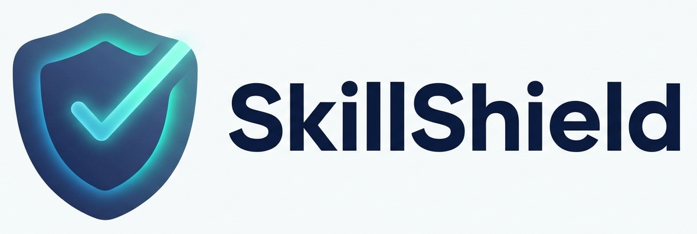

<p align="center">
  
</p>

# SkillShield

Security-scanned mirror and public trust layer for AI skills.

SkillShield mirrors skills from ClawHub and `skills.sh`, runs Cisco's `skill-scanner`, publishes public reports, and only serves artifacts that pass policy. The public edge runs on Cloudflare Workers, while a separate scanner service handles the heavier archive, filesystem, and scanner-runtime work.

## Why

Skill ecosystems are getting more powerful, but they are also getting harder to trust.

SkillShield exists to make skill distribution safer by adding:

- public verification status for mirrored skills
- security scanning before artifacts are served
- compatibility layers for existing clients
- public reports, badges, and health/status endpoints
- webhook- and scrape-based freshness updates

## What It Supports

### ClawHub-compatible mirror

- ClawHub-style metadata and download routes under `/clawhub/api/v1/*`
- webhook ingestion for new publish events
- mirrored artifacts only served when verdicts allow it

### skills.sh-compatible surface

- `SKILLS_API_URL`-compatible search route at `/api/search`
- skills.sh metadata and download routes under `/skills/*`
- GitHub webhook ingestion for indexed skills.sh-backed repos

### Public trust surface

- dashboard at `/`
- health endpoint at `/health`
- public reports under `/reports/*`
- public badges under `/badge/*`
- unified API routes under `/api/v1/*`

## Architecture

### `packages/worker`

Cloudflare Worker entrypoint and public API surface.

It serves:

- dashboard
- compatibility routes
- public reports and badges
- webhook ingestion
- queue consumption for scan jobs

### `packages/scanner`

Private scanner service.

It is responsible for:

- fetching skills from upstream sources
- running Cisco `skill-scanner`
- building ZIP or tarball artifacts
- publishing results to R2 and D1
- running bounded or full-source scrapes

### `packages/shared`

Shared types, constants, and Zod schemas used by both runtimes.

### `packages/dashboard`

HTML renderer for the public Worker home page.

## Repo Layout

```text
packages/
  worker/      Cloudflare Worker and public routes
  scanner/     Scanner service and source adapters
  shared/      Shared schemas and types
  dashboard/   Dashboard HTML renderer

infrastructure/
  terraform/   Cloudflare infrastructure definitions

.github/
  workflows/   Worker deploy, scanner deploy, and full-scrape workflows

docs/
  production-cutover-runbook.md
```

## Quick Start

```bash
npx pnpm@10.6.3 install
npx pnpm@10.6.3 build
npx pnpm@10.6.3 typecheck
npx pnpm@10.6.3 test
```

`npx pnpm@10.6.3` is the safest path in this repo because plain Corepack-backed `pnpm` has failed in this environment before package execution with signing-key verification issues.

## Local Development

### Worker

```bash
npx pnpm@10.6.3 --filter @skillshield/worker dev
```

Useful checks:

```bash
curl http://127.0.0.1:8787/health
curl "http://127.0.0.1:8787/api/search?q=design&limit=10"
curl http://127.0.0.1:8787/api/v1/stats
curl http://127.0.0.1:8787/
```

### CLI quick setup

Point either CLI at your SkillShield endpoint with an environment variable.

#### ClawHub CLI

```bash
CLAWHUB_REGISTRY=http://127.0.0.1:8787/clawhub clawhub install trello
```

Production example:

```bash
CLAWHUB_REGISTRY=https://skillshield.cochat.ai/clawhub clawhub install trello
```

#### skills.sh CLI

```bash
SKILLS_API_URL=http://127.0.0.1:8787 npx skills find design
```

Production example:

```bash
SKILLS_API_URL=https://skillshield.cochat.ai npx skills find design
```

### Scanner service

```bash
npx pnpm@10.6.3 --filter @skillshield/scanner build
npx pnpm@10.6.3 --filter @skillshield/scanner test
```

The scanner path depends on Cisco `skill-scanner` plus archive tooling. If you want to exercise the real runtime locally, use the scanner Docker image instead of relying only on mocked unit coverage.

### Scanner container

```bash
docker build -f packages/scanner/Dockerfile -t skillshield-scanner .
docker run --rm -p 3100:3100 skillshield-scanner
curl http://127.0.0.1:3100/health
```

### Dashboard renderer

```bash
npx pnpm@10.6.3 --filter @skillshield/dashboard build
npx pnpm@10.6.3 --filter @skillshield/dashboard test
```

## Public Routes

- `/` dashboard
- `/health` Worker health check
- `/api/search` skills.sh-compatible search API
- `/clawhub/api/v1/*` ClawHub-compatible mirror routes
- `/skills/*` skills.sh mirror routes
- `/api/v1/stats`
- `/api/v1/search` — accepts `q`, `source`, `verdict`, `category`, `sort` (`installs:desc` (default), `recent`, `name:asc`), `limit` (max 100), `offset`
- `/api/v1/recent`
- `/api/v1/verify/:source/:slug`
- `/reports/*`
- `/badge/*`
- `/webhooks/clawhub`
- `/webhooks/github`

## Environment

### Worker bindings and vars

- `DB` Cloudflare D1 database
- `SKILLS_BUCKET` Cloudflare R2 bucket for mirrored artifacts
- `REPORTS_BUCKET` Cloudflare R2 bucket for reports
- `META_BUCKET` Cloudflare R2 bucket for metadata
- `SCAN_QUEUE` Cloudflare Queue binding
- `SCANNER_BASE_URL` scanner service base URL
- `SCANNER_REQUEST_TIMEOUT_MS` optional queue-forward timeout
- `SCANNER_AUTH_TOKEN` optional scanner auth token
- `WEBHOOK_SECRET` optional shared webhook secret

### Scanner runtime env

- `SCANNER_AUTH_TOKEN`
- `CF_ACCOUNT_ID`
- `CF_API_TOKEN`
- `D1_DATABASE_ID`
- `R2_ENDPOINT`
- `R2_ACCESS_KEY_ID`
- `R2_SECRET_ACCESS_KEY`
- optional `R2_SESSION_TOKEN`
- optional `R2_SKILLS_BUCKET`
- optional `R2_REPORTS_BUCKET`
- optional `SKILL_SCANNER_LLM_API_KEY`
- optional `SKILL_SCANNER_LLM_MODEL`
- optional `VIRUSTOTAL_API_KEY`

## Deployment

The repo is structured so that the remaining production work is cutover-only: real secrets, real account-specific IDs, deploy/apply, initial scrapes, and webhook registration.

For the exact production sequence, use:

- `docs/production-cutover-runbook.md`

### Deployment components

- Cloudflare Worker for the public edge
- Cloudflare D1 for scan state and webhook events
- Cloudflare R2 for reports and mirrored artifacts
- Cloudflare Queue for scan-job transport
- Fly.io for the private scanner service

### CI/CD workflows

- `.github/workflows/deploy-worker.yml`
- `.github/workflows/deploy-scanner.yml`
- `.github/workflows/full-scrape.yml`
- `.github/workflows/installs-refresh.yml` — daily skills.sh install-count refresh

### Database migrations

- `packages/worker/schema.sql` — base schema for fresh D1 databases
- `packages/worker/migrations/0001_add_category_and_installs_metadata.sql` — adds `category`, `installs_updated_at`, and the matching indexes to existing deployments. Apply with `wrangler d1 execute --file=packages/worker/migrations/0001_add_category_and_installs_metadata.sql`.

## Validation

The most useful local validation path is:

```bash
npx pnpm@10.6.3 build
npx pnpm@10.6.3 typecheck
npx pnpm@10.6.3 test
```

If you want to validate production-shaped assets locally as well:

```bash
docker build -f packages/scanner/Dockerfile -t skillshield-scanner .
terraform -chdir=infrastructure/terraform init -backend=false
terraform -chdir=infrastructure/terraform validate
```

## Project Status

SkillShield is now set up so the remaining path to production is operational cutover, not missing core implementation work.

That means the main remaining launch steps are:

- apply real secrets and account-specific IDs
- deploy the scanner and Worker
- apply the D1 schema
- run bounded and full scrapes
- register upstream webhooks

## Related Docs

- `docs/production-cutover-runbook.md`
- `plan.md`

## Contributing

If you want to contribute, the best place to start is:

1. `packages/worker/src/index.ts`
2. `packages/scanner/src/index.ts`
3. `packages/shared/src/schemas.ts`
4. `docs/production-cutover-runbook.md`

If you change runtime contracts between Worker and scanner, update shared schemas and tests first.
